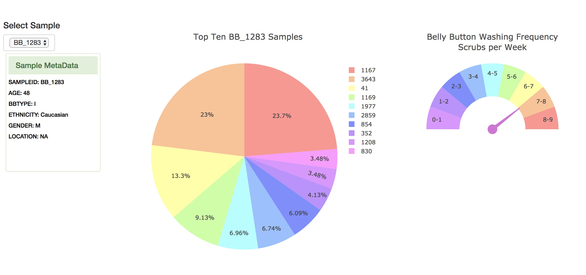

# BBDashboard
BB Biodiversity Dashboard

This project used JavaScript, Plotly.JS, Python, HTML, CSS, Bootstrap, and Flask to explore the Belly Button Biodiversity dataset. I read the data from CSV files using Pandas. I then built three graphs using Plotly and Javascript. The pie chart shows the top ten samples for a particular sample id. The bubble chart shows all the samples and OTU ID data points. Metadata for the sample is also displayed, along with a gauge chart for washing frequency. The graphs resize when the page size is modified.

Description of the Code Files:

app.py - the Flask app that calls the Python functions to read and store the bio samples, OTU and metadata 

bb_functions.py - the Python functions that use Pandas to read the files and store the data in JSON-like structures

index.html - Contains the JavaScript code to get the data and create the 3 charts, the metadata, and the dropdown with the list of sample IDs.

style.css - CSS styling for the panel

